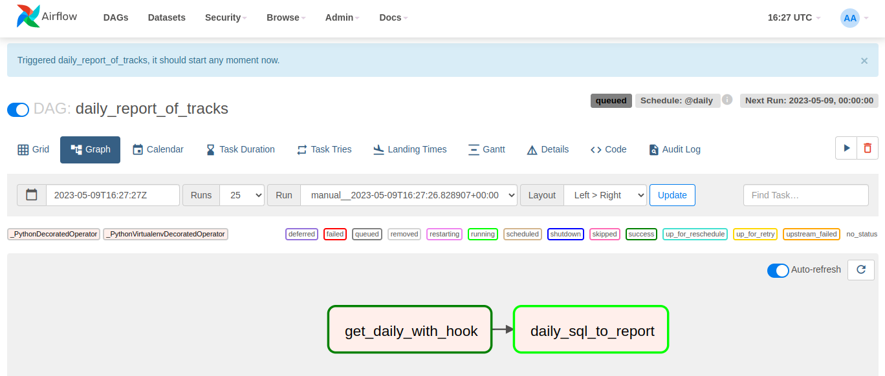

## What for (block generated with Copilot):

1) play with radar API & Business account rights
2) play with airflow and other stuff
3) check how much flights was in the air in the last 24 hours (e.g. you gonna bought a dacha and want to know how much
   flights will be over the head)

## Image (generated with Shedevrum.ai)

## Reqs: 

* python 3.10.10, Docker

## How to run (~~finally I did this block by myself~~):

1) run PostgresSQL Docker
   docker-compose -f docker/docker-compose.dev.yml up -d
2) initDB with:
   python planetrack_collector/bin/pg-init-scripts/init.py
   working directory: root: planetrack_collector
3) install reqs file & run flask APP:
   FLASK_APP=run.py
   FLASK_ENV=config.DevelopmentConfig
   all other ENV VARS specified in config.py, like TRACKING_ARIA, RADAR_LOGIN, RADAR_PASSWORD etc.
4) erase airflow dir and install with official documentation by: airflow/install.sh
   docker-compose -f airflow/docker-compose.yaml up -d
5) use declared dag: airflow/dags/count_of_tracks.py
6) dag create the report but not store it anywhere
   cos: https://airflow.apache.org/docs/apache-airflow/stable/best-practices.html
   in alternative reality it should be sent to s3 or simular

4-5*
Use an external network in the downloaded docker-compose airflow file (otherwise postgres data and airflow are not seeing
each other):

`networks:
proxy-net:
name: docker_data-net
external: true`

Such network already mentioned in Postgres data storage dc, just add this in each airflow service:

`networks:
-proxy-net`

Example of modified dc provided: airflow/docker-compose.yaml
Result:

## Feel free to reach me out or open an issue if you have any questions or suggestions.
